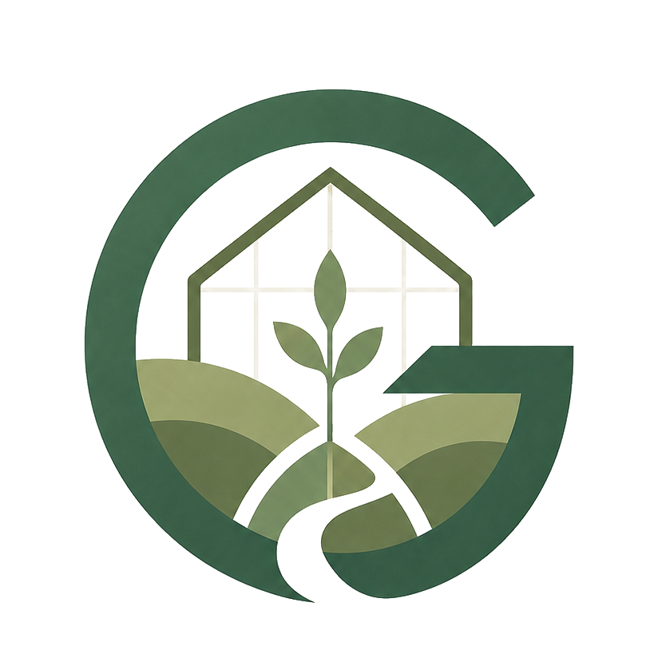

<p align="center">
  
</p>

<h1 align="center">Greenhouse</h1>

<p align="center">
  Repo-local tending infrastructure for safer agentic engineering.
</p>

<p align="center">
  <code>status</code> · <code>tend</code> · <code>verify</code> · <code>proposals</code> · <code>evidence</code>
</p>

---

Greenhouse helps an existing repository stay understandable and safe as humans
and AI agents change it. It maps the repo shape, protects authored rules,
routes changed files to the right validation, detects structural drift, proposes
safe maintenance updates, and records evidence for future work.

It is intentionally lightweight at the surface:

```bash
greenhouse-spec status
# work normally
greenhouse-spec tend
```

Greenhouse is not a feature-planning framework like Spec Kit or OpenSpec. Those
tools help define what to build. Greenhouse cares for the repository around the
work: what changed, what should be validated, what assumptions may have drifted,
and what evidence should be left behind.

## Why It Exists

AI agents can enter a repo cold and still make useful changes. The difficult
part is making sure they understand enough of the local contract before they
finish:

- Which files are authored, generated, or protected?
- Which tests or checks should run for the files that changed?
- Did a new source area appear without validation coverage?
- Did package scripts, docs, generated outputs, or validation roots drift?
- Is a failure new, repeated, or already explained by recent evidence?
- What should the next agent or human know about this change?

Greenhouse turns those questions into repo-local files, commands, proposals,
and evidence instead of relying on hidden chat memory.

## What Greenhouse Does

- Installs a `.greenhouse/` layer into a target repo.
- Discovers package scripts, source areas, generated outputs, docs, risks, and
  agent instruction files.
- Routes changed files through scoped validation rules.
- Escalates high-risk paths such as generated output contracts, official source
  handling, financial calculations, reporting output, readiness gates, and
  Tauri/Rust runtime paths.
- Detects when source changes are falling back to broad validation and proposes
  managed route seeds.
- Writes bounded validation evidence without making known failures appear green.
- Keeps generated intelligence disposable under `.greenhouse/grown/**`.
- Protects authored roots and applies only explicit safe proposals.
- Checks real repo alignment against Declarion, Sourcer, and Ensember.

## The Core Loop

For daily work:

```bash
greenhouse-spec status
greenhouse-spec tend
```

When Greenhouse reports repo evolution work:

```bash
greenhouse-spec inspect
greenhouse-spec proposals
greenhouse-spec apply-proposals --safe --dry-run
greenhouse-spec apply-proposals --safe
greenhouse-spec tend
```

For direct validation:

```bash
greenhouse-spec verify --changed --dry-run
greenhouse-spec verify --changed --write-evidence
```

For structural checks in CI or pre-push hooks:

```bash
greenhouse-spec tend --check
```

## Status At A Glance

`status` is read-only. It gives one short health view:

```text
Greenhouse Status

Repository: /path/to/repo
State: pass
Changed: 2 file(s), 2 routed
Validation: covered by latest passing evidence.
Drift: none blocking.
Impact: none.
Repeated failures: none.
Next: no action needed
```

Status can be:

```text
pass
  Greenhouse is installed, current changes are covered, and no blocking drift is
  detected.

degraded
  Greenhouse is operational, but there is unresolved context an agent should not
  ignore, such as selected validation without evidence or repeated failures.

fail
  Install health, structural drift, missing commands, blocking impact, or actual
  validation failure needs attention.
```

## The `.greenhouse` Folder

```text
.greenhouse/
  roots/                  authored repo contract
    validation.yaml       validation modes, path routes, risk routes
    docs.yaml             documentation ownership and drift hints
    rules.md              agent behavior rules
    authority.md          source authority rules
    protected-boundaries.md

  grown/                  generated and disposable repo intelligence
    repo-map.yaml
    repo-shape.yaml
    command-index.yaml
    risk-index.yaml
    validation-proposals.yaml
    evidence-index.yaml
    failure-signatures.yaml

  context/
    manifest.yaml         agent-readable context routing

  evidence/               validation records
  reports/                generated reports
  scripts/                installed helper scripts
  templates/              evidence/report templates
```

The boundary is the product:

```text
Greenhouse may freely rewrite:
  .greenhouse/grown/**

Greenhouse may append:
  .greenhouse/evidence/**
  .greenhouse/reports/**

Greenhouse edits authored files only through explicit commands:
  package.json
  .greenhouse/roots/validation.yaml
  .greenhouse/roots/proposal-decisions.yaml
```

## Proposals

Greenhouse prefers visible proposals over hidden mutation.

`inspect` refreshes `.greenhouse/grown/validation-proposals.yaml`. Then:

```bash
greenhouse-spec proposals
greenhouse-spec apply-proposals --safe
greenhouse-spec adopt-proposals --id <proposal-id>
greenhouse-spec proposals dismiss --id <proposal-id> --reason "..."
```

Proposal states:

```text
pending
  Missing safe wiring. Safe apply may add it.

adoptable
  Human-authored wiring already matches. Adoption only adds Greenhouse metadata.

conflict
  Human-owned content differs. Review manually.

applied
  Managed wiring already matches current discovery.

skipped
  A proposal was intentionally dismissed.
```

## Validation Routing

Greenhouse starts with changed files and applies:

1. explicit path rules from `.greenhouse/roots/validation.yaml`,
2. generated risk paths from `.greenhouse/grown/risk-index.yaml`,
3. lightweight inferred routes for docs, CLI, app, config, and Greenhouse roots,
4. guarded fallback only when no better route exists.

A source file should not appear clean just because no route matched it. When
Greenhouse falls back broadly for source changes, it reports route drift and can
propose a scoped validation route for recognized repo areas.

## Evidence

Evidence is repo-local memory for future agents. It records:

- changed files,
- selected validation,
- route reasons,
- pass/fail results,
- manual checks,
- impact warnings,
- repeated failure annotations,
- tending state.

Evidence does not weaken validation. A known or repeated failure is explained,
not treated as success.

## Installing Into Another Repo

Current proof-of-concept installs use a local checkout:

```bash
cd /path/to/greenhouse-spec
pnpm install
pnpm build

cd /path/to/target-repo
node /path/to/greenhouse-spec/dist/cli.js init
node /path/to/greenhouse-spec/dist/cli.js inspect
node /path/to/greenhouse-spec/dist/cli.js proposals
node /path/to/greenhouse-spec/dist/cli.js apply-proposals --safe --dry-run
```

Greenhouse can propose package scripts for the target repo, for example:

```json
{
  "greenhouse": "greenhouse-spec status",
  "greenhouse:tend": "greenhouse-spec tend",
  "greenhouse:tend:check": "greenhouse-spec tend --check",
  "greenhouse:verify:dry": "greenhouse-spec verify --changed --dry-run",
  "greenhouse:proposals": "greenhouse-spec proposals",
  "prepush": "pnpm greenhouse:tend"
}
```

See [docs/installation.md](docs/installation.md) for the fuller install model.

## Commands

```text
status
  Read-only repo health overview.

tend
  Everyday finish gate. Runs install health, drift checks, changed-file
  validation, evidence writing, and proposal summary.

tend --check
  Structural-only check for CI and debugging. Does not run validation.

verify --changed --dry-run
  Explain what validation would run and why.

verify --changed --write-evidence
  Run selected validation and write evidence.

inspect
  Refresh generated intelligence under .greenhouse/grown/**.

proposals
  Show pending, adoptable, conflict, applied, and skipped repo maintenance work.

apply-proposals --safe
  Apply safe package scripts and Greenhouse-managed validation routes.

doctor
  Validate installed Greenhouse files and command wiring.
```

See [docs/commands.md](docs/commands.md) for more detail.

## Alignment Repos

Greenhouse is shaped against three local repo styles:

```text
Declarion
  Single-package React/Vite app with CLI and domain-specific validation.

Sourcer
  Polyglot workspace with React frontend, Java/Maven backend, API spec, and infra.

Ensember
  React/Vite desktop app with Tauri, Rust/Cargo backend, and local runtime state.
```

Run the local alignment suite:

```bash
pnpm alignment:check
```

## Development

```bash
pnpm install
pnpm test
pnpm typecheck
pnpm build
pnpm check
node dist/cli.js --help
```

`pnpm check` runs typecheck, tests, and build.

## Documentation

- [docs/README.md](docs/README.md) - documentation index
- [docs/architecture.md](docs/architecture.md) - implementation map and data flow
- [docs/architecture-contract.md](docs/architecture-contract.md) - ownership boundaries
- [docs/installation.md](docs/installation.md) - installing into another repo
- [docs/commands.md](docs/commands.md) - command reference
- [docs/proposals.md](docs/proposals.md) - proposal lifecycle
- [docs/validation-routing.md](docs/validation-routing.md) - routing and evidence behavior
- [docs/operating-playbook.md](docs/operating-playbook.md) - day-to-day usage

## Project Principles

- Keep normal work fluent: status, work, tend.
- Prefer repo-local evidence over hidden agent memory.
- Protect authored roots.
- Treat generated intelligence as disposable.
- Use proposals for repo evolution.
- Never make known failures green.
- Keep validation scoped, but never let unknown source changes appear clean.
